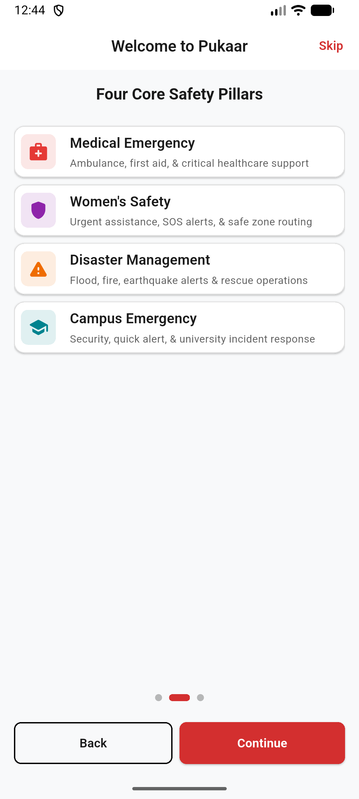
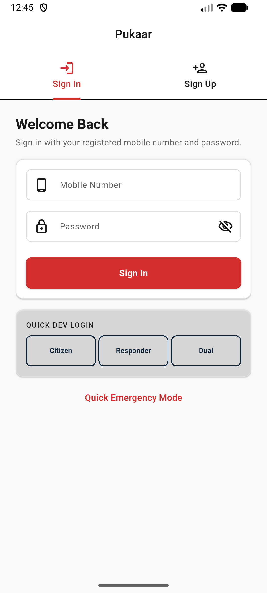
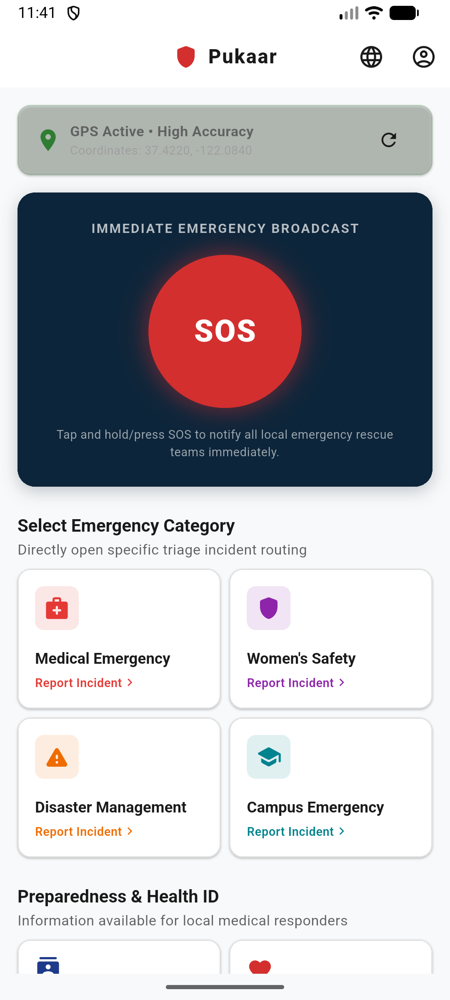
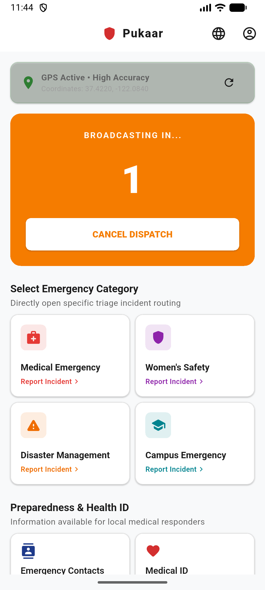
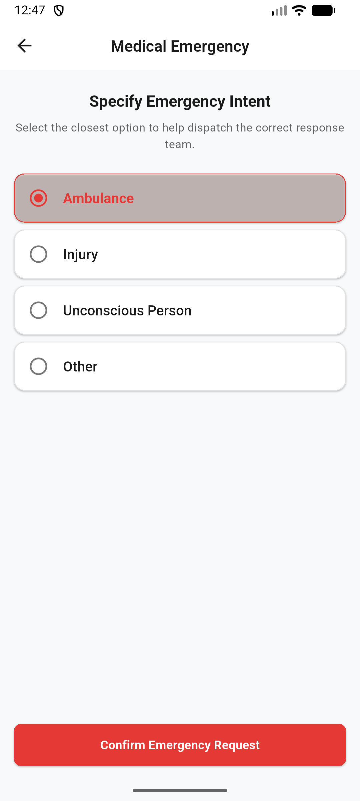
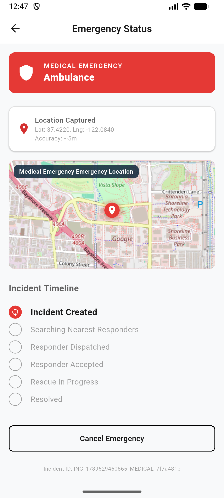
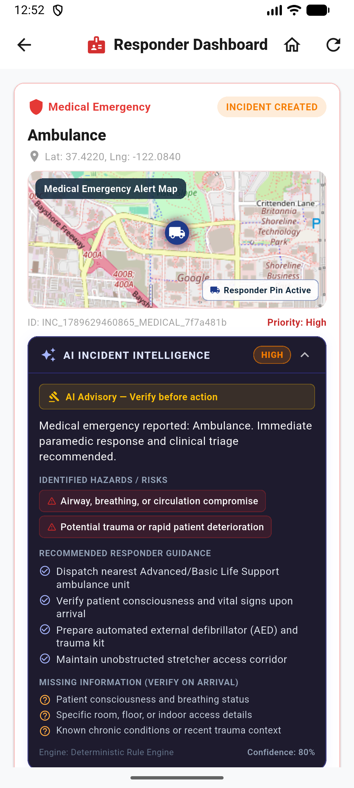
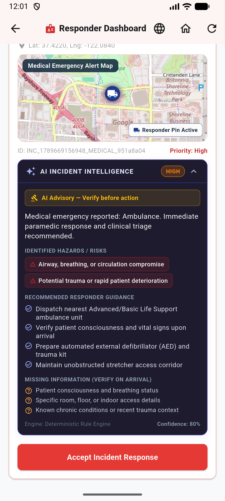
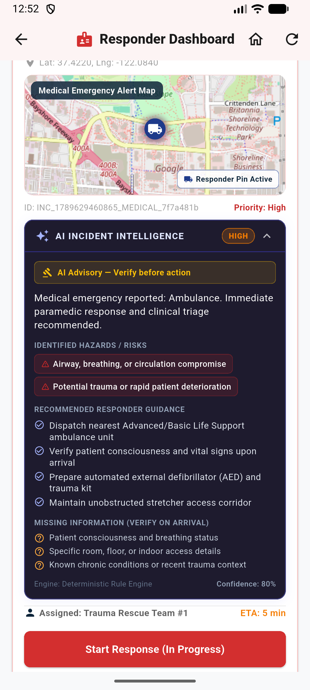

# 🚨 Pukaar — Next-Gen Emergency Response & Dispatch System

**Pukaar** is a unified, high-availability emergency platform designed to connect citizens in distress with rapid-response dispatchers and emergency personnel. Pukaar streamlines triage across four core emergency pillars, captures precise GPS telemetry, visualizes live incident locations on OpenStreetMap, and synchronizes real-time status transitions between citizens and responder dashboards.

---

## 🌟 Key Features

### 🛡️ Citizen Emergency Experience
- **Immediate SOS Trigger**: One-tap emergency broadcast with automated GPS coordinate capture.
- **Voice Emergency Input**: Hands-free voice reporting via on-device speech-to-text on the Emergency Intent screen (`VoiceEmergencyInputCard`), enabling citizens to speak distress details naturally with real-time feedback, editable text fallback, and explicit dispatch confirmation.
- **Multilingual Localization**: Complete application-wide localization supporting **English**, **हिन्दी (Hindi)**, and **मराठी (Marathi)** with persistent language preferences via `SharedPreferences`, instant reactive language switching across all screens without app restart, and automatic speech recognition locale resolution (`en_IN`, `hi_IN`, `mr_IN`).
- **Pillar-Based Triage Flow**: Specialized subcategory intent selection across 4 core pillars:
  - 🚑 **Medical Emergency** (Trauma care, Cardiac arrest, Ambulance request)
  - ♀️ **Women's Safety** (Harassment, SOS alert, Rapid escort)
  - 🌪️ **Disaster Management** (Flood, Fire, Earthquake rescue)
  - 🏫 **Campus Emergency** (University security, Campus distress)
- **Live Incident Tracking**: Real-time tracking screen displaying incident lifecycle progression (`Created` ➔ `Searching` ➔ `Dispatched` ➔ `Accepted` ➔ `In Progress` ➔ `Resolved` / `Cancelled`).
- **Interactive OpenStreetMap**: Visual location map (`flutter_map`) displaying captured incident coordinates and active responder pin.
- **Incident Cancellation**: Citizen-initiated cancellation with reason confirmation.

### 🚓 Emergency Responder System & AI Intelligence
- **Responder Dashboard**: Real-time active incident feed for emergency response units (`/responder-dashboard`).
- **AI Incident Intelligence**: Contextual clinical and tactical intelligence advisory for every incident, highlighting prioritized hazard tags, recommended responder operational guidance, missing arrival checks, and engine confidence metrics.
- **One-Tap Status Lifecycle Management**: Responders can accept dispatches, initiate active response, and mark incidents resolved.
- **Responder GPS Context**: Displays current responder device location alongside citizen emergency coordinates.

### ⚙️ Production-Ready Backend & Architecture
- **FastAPI REST Service**: Python 3.10+ backend with in-memory incident persistence store and CORS middleware (`/incidents`, `/incidents/active`, `/incidents/{id}/status`, `/incidents/{id}/assign-responder`, `/health`).
- **Clean Architecture & Dependency Injection**: Modular service locator (`ServiceLocator`) allowing seamless switching between `MockEmergencyService` (demo mode) and `ApiEmergencyService` (live backend API).

---

## 📂 Architecture & Project Structure

```
pukaar/
├── lib/
│   ├── core/
│   │   ├── config/             # AppConfig, environment & API endpoints
│   │   ├── constants/          # AppColors, AppDimensions, AppStrings
│   │   ├── localization/       # AppLocalizations, LanguageSelectionDialog, LocalizationService
│   │   ├── models/             # EmergencyIncident, EmergencyCategory, EmergencyStatus
│   │   ├── repositories/       # EmergencyRepository (API & Mock implementations)
│   │   ├── routing/            # AppRouter & AppRoutes
│   │   ├── services/           # ServiceLocator, ApiService, LocationService, AuthService, SpeechService
│   │   └── widgets/            # EmergencyMap (flutter_map / OpenStreetMap integration), LanguageSwitcherButton
│   ├── features/
│   │   ├── auth/               # Login & Registration screens
│   │   ├── emergency/          # Intent Triage, Voice Emergency Input & Citizen Tracking screens
│   │   ├── home/               # Home dashboard & SOS trigger
│   │   ├── onboarding/         # Splash & Onboarding screens
│   │   ├── profile/            # Citizen Profile, Medical ID & Emergency Contacts
│   │   └── responder/          # Responder Dashboard & AI Incident Intelligence card
│   └── shared/                 # Reusable UI cards, buttons & state widgets
├── backend/                    # Python FastAPI Backend Service
│   ├── app/                    # FastAPI routes, models & store
│   ├── tests/                  # Pytest backend test suite
│   └── requirements.txt        # Backend dependencies
└── test/                       # Comprehensive Flutter Unit & Widget Test Suite
```

---

## 🚀 Getting Started

### Prerequisites
- **Flutter SDK**: `>= 3.13.2`
- **Dart SDK**: `>= 3.13.2`
- **Python**: `>= 3.10`
- **Android Studio / VS Code** with Android Emulator

---

### 1. Flutter Mobile App Setup

```bash
# Clone repository & navigate to project directory
cd pukaar

# Install Flutter dependencies
flutter pub get

# Run static analysis
flutter analyze

# Run Flutter test suite (112 passing tests)
flutter test

# Launch mobile application on Android Emulator
flutter run -d emulator-5554
```

---

### 2. FastAPI Backend Server Setup (Optional for Live API Mode)

The Flutter app runs in **Mock Mode** by default. To connect Flutter to the local FastAPI backend server:

```bash
# Navigate to backend directory
cd backend

# Create & activate virtual environment (optional)
python -m venv venv
# On Windows:
.\venv\Scripts\activate
# On Linux/macOS:
source venv/bin/activate

# Install backend dependencies
pip install -r requirements.txt

# Run pytest backend test suite (60 passing tests)
python -m pytest tests

# Start local FastAPI server
uvicorn app.main:app --reload --host 0.0.0.0 --port 8000
```

#### Enabling Backend API Mode in Flutter
In `lib/main.dart`, pass `useBackendApi: true` to `ServiceLocator`:
```dart
void main() {
  WidgetsFlutterBinding.ensureInitialized();
  ServiceLocator.instance.init(useBackendApi: true);
  runApp(const PukaarApp());
}
```
*(Android Emulator connects to host backend via `http://10.0.2.2:8000`)*

## 📱 Application Screenshots

### Citizen App & Onboarding
<table>
<tr>
<td align="center"><b>Multilingual Onboarding Selection</b></td>
<td align="center"><b>Authentication & Quick Dev Login</b></td>
<td align="center"><b>Citizen Home Dashboard</b></td>
</tr>
<tr>
<td></td>
<td></td>
<td></td>
</tr>
</table>

### Emergency Response & Tracking Flow
<table>
<tr>
<td align="center"><b>Active SOS Broadcast</b></td>
<td align="center"><b>Voice Input & Intent Triage</b></td>
<td align="center"><b>Live OpenStreetMap Tracking</b></td>
</tr>
<tr>
<td></td>
<td></td>
<td></td>
</tr>
</table>

### Responder App & AI Incident Intelligence
<table>
<tr>
<td align="center"><b>Responder Active Feed</b></td>
<td align="center"><b>AI Incident Intelligence</b></td>
<td align="center"><b>Dispatch Assignment & ETA</b></td>
</tr>
<tr>
<td></td>
<td></td>
<td></td>
</tr>
</table>

---

## 🧪 Testing Summary

- **Flutter Unit & Widget Tests**: `112 / 112 Passed` (`flutter test`)
- **FastAPI Pytest Backend Suite**: `60 / 60 Passed` (`python -m pytest backend/tests`)
- **Flutter Code Analysis**: `0 Issues / Clean` (`flutter analyze`)

---

## 📄 License

This project is licensed under the MIT License — see the LICENSE file for details.

